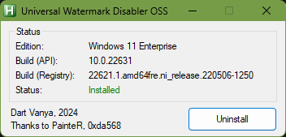

# GUI installer on AutoHotkey
Also open source, written on AHK v1.1
## Installation / Removal
Download compiled standalone installer for your OS: [64-bit](https://github.com/DartVanya/uwd-oss/raw/main/Installer%20GUI/Compiled/UWD-OSS.exe) / [32-bit](https://github.com/DartVanya/uwd-oss/raw/main/Installer%20GUI/Compiled/UWD-OSS_x86.exe). EXE packed with UPX.
### Installation
Run (accept UAC prompt if needed), click Install. Watermark should gone.

### Removal
Run (accept UAC prompt if needed), click Uninstall.

*****
## Features
  - No need to restart Explorer or logoff.
    - changes are applied immediately by inject/uninject dll into/from Explorer process and force redraw of the desktop
  - Script acquire TrustedInstaller privileges when making changes to the registry
  - Support both x64 and x86 (note: compiled x86 version cannot run on 64-bit OS)
*****

# Compability
Tested on Windows 11 23H2, removes Test Mode and Safe Mode watermarks.\
To run installer script from source, clone repo and run UWD-OSS.ahk from admin IDE or from "Run with UI Access" menu (AutoHotkey v1.1 should be installed).
