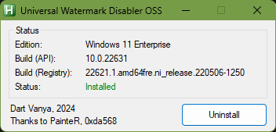

# uwd-oss

Open source alternative to the Universal Watermark Remover.

# Introduction

This is a sequel to my [Universal Watermark Remover reverse engineering writeup](https://github.com/0xda568/Universal-Watermark-Disabler-Reverse-Engineering). I analyzed the closed source-software and developed my own open source version of it, which you can find here.

After I posted my reverse engineering article, the original developerof the universal watermark remover (@pr701) published the [original software source code](https://github.com/pr701/universal-watermark-disabler)

# How does it work?

This oss implementation of the Universal Watermark Remover uses an IAT hook now.

The original software utilizes [COM-hijacking](https://www.ired.team/offensive-security/persistence/t1122-com-hijacking) and [DLL-Proxying](https://www.ired.team/offensive-security/persistence/dll-proxying-for-persistence) to inject a DLL into the explorer and to persist on the system. The DLL, then hooks [ExtTextOutW](https://learn.microsoft.com/en-us/windows/win32/api/wingdi/nf-wingdi-exttextouta) to suppress the display of the testsigning watermark.

For a deeper dive (especially for beginners), take a look at my reverse-engineering writeup.

# Structure

`uwd-oss/` - Contains the source of the DLL that hooks the display function

`Installer\ GUI/` - Source code of the installer GUI created by @DartVanya

`old/` - This is an old stage of the project, which is very buggy on some Windows versions and tried to implement the DLL proxy exactly like the original uwd.

# GUI installer on AutoHotkey

Also open source, written on AHK v1.1

## Installation / Removal

Download compiled standalone installer for your OS from the releases. The EXE is packed with UPX.

### Installation

Run (accept UAC prompt if needed), click Install. Watermark should be gone.

### Removal

Run (accept UAC prompt if needed), click Uninstall.

*****

## Features

- No need to restart Explorer or logoff.
  - changes are applied immediately by inject/uninject dll into/from Explorer process and force redraw of the desktop
- Script acquire TrustedInstaller privileges when making changes to the registry
- Support both x64 and x86 (note: compiled x86 version cannot run on 64-bit OS)

*****

# Compability

Tested on Windows 11 23H2, removes Test Mode and Safe Mode watermarks.\
To run installer script from source, clone repo and run UWD-OSS.ahk from admin IDE or from "Run with UI Access" menu (AutoHotkey v1.1 should be installed).

# Credit

Many thanks to @DartVanya for the GUI and for the improvements!
