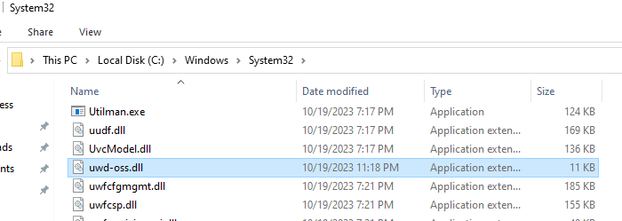
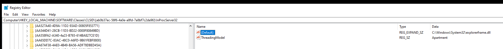
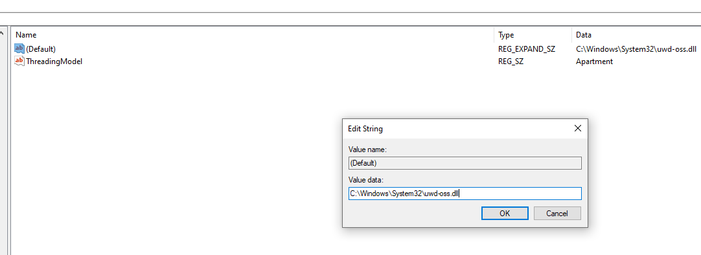
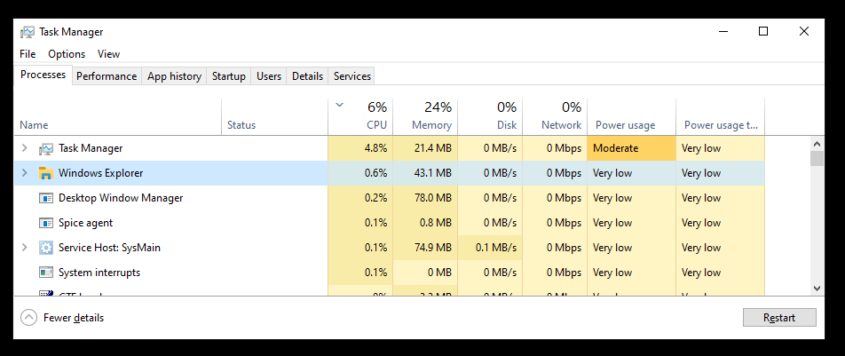
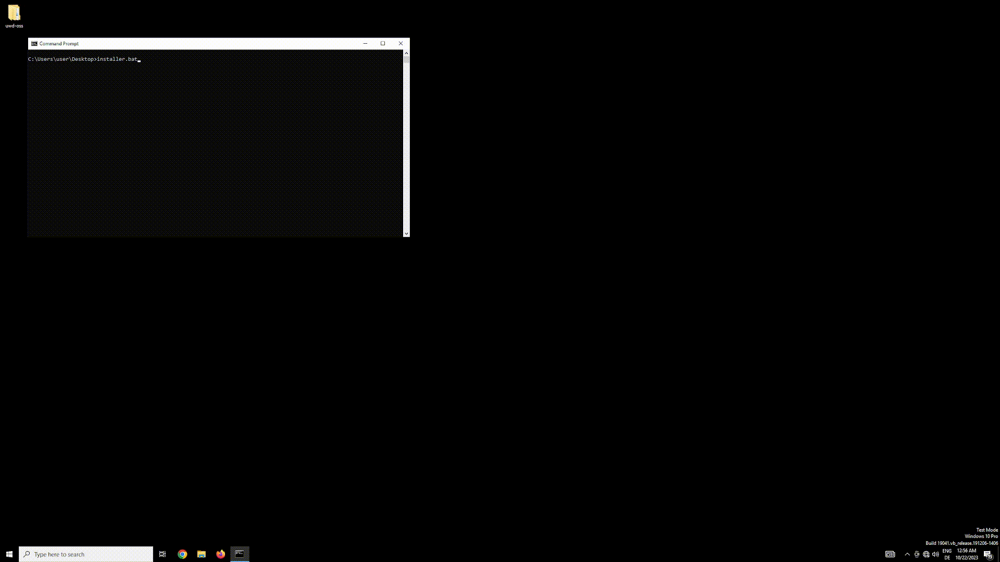

# uwd-oss
Open source alternative to the Universal Watermark Remover.

# Introduction
This is a sequel to my [Universal Watermark Remover reverse engineering writeup](https://github.com/0xda568/Universal-Watermark-Disabler-Reverse-Engineering). I analyzed the closed source-software and developed my own opensource version of it, which you can find here.

# How does it work?
The batch script utilizes [COM-hijacking](https://www.ired.team/offensive-security/persistence/t1122-com-hijacking) and [DLL-Proxying](https://www.ired.team/offensive-security/persistence/dll-proxying-for-persistence) to inject a DLL into the explorer and to persist on the system. The DLL, then hooks [ExtTextOutW](https://learn.microsoft.com/en-us/windows/win32/api/wingdi/nf-wingdi-exttextouta) to suppress the display of the testsigning watermark.

For a deeper dive (especially for beginners), take a look at my reverse-engineering writeup.

# Installation / Removal
## Script
### Installation
Get the installer.bat and uwd-oss.dll from the [releases](https://github.com/0xda568/uwd-oss/releases/tag/first) and put them into the same folder. Then simply execute installer.bat and everything should work.

### Removal
Simply execute the script again and everything should be reverted.

## Manual installation
### Step 1
Download **uwd-oss.dll** from the official [release](https://github.com/0xda568/uwd-oss/releases/tag/first) and copy it into **C:\\Winodws\\System32\\**

### Step 2
Now, you need to modify the registry, which can be dangerous so follow the steps cautiously.
  - Open the **Registry Editor**
  - Find the following key:
      **Computer\HKEY_LOCAL_MACHINE\SOFTWARE\Classes\CLSID\{ab0b37ec-56f6-4a0e-a8fd-7a8bf7c2da96}\InProcServer32**
    
  - Modify the value **(Default)** to: **C:\\Windows\\System32\\uwd-oss.dll**
    
  - Make sure you have no typos!

### Step 3
Open the **Task manager** and find the explorer process and click on restart.

After the explorer restarts, the watermark should be gone.

## Manual removal
### Step 1
Follow the same steps described in **Manual installation - Step 2**, but:
  - change the value of **(Default)** back to **C:\\Windows\\System32\\explorerframe.dll**

### Step 2
Delete **C:\\Windows\\System32\\uwd-oss.dll**

### Step 3
Restart the explorer, as described in **Manual installation - Step 3**

After the explorer restarts, the watermark should appear again (if testsigning mode is still activated) and everything should be reverted.

# Showcase

# Info
Since the script modifies the registry, Admin privileges are needed.

# Compability
Tested on Windows 10 x64. Should also work on Windows 11, x64.
  - currently buggy on windows 11 pro insider
